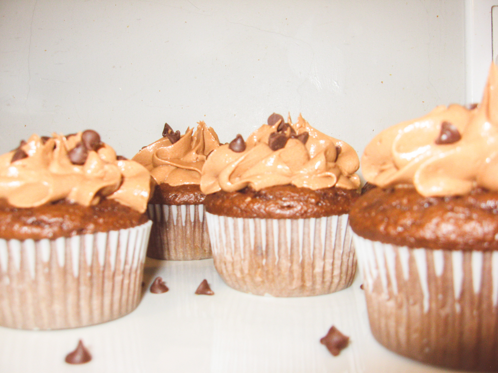
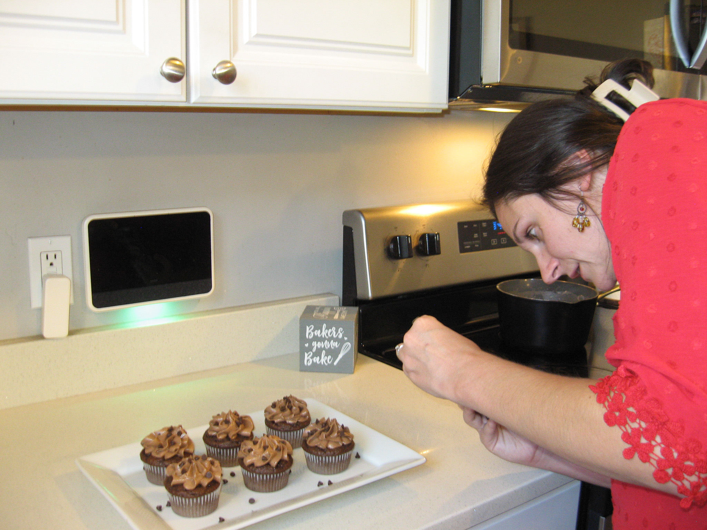
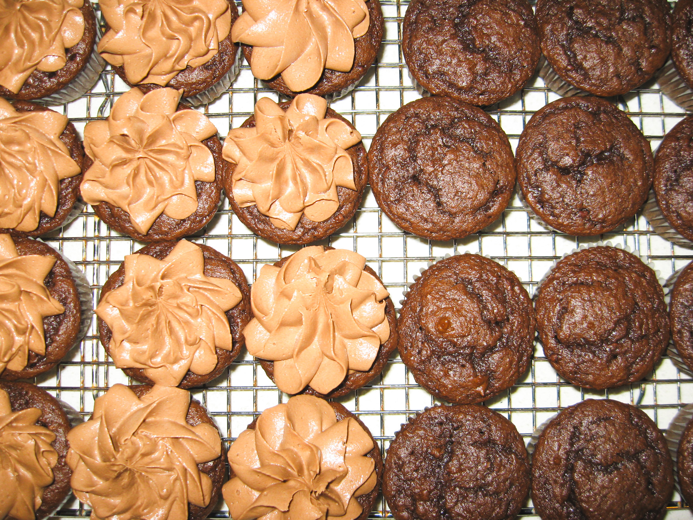

<!-- fc78b5 -->

<!-- Carousel with Shop Now Button -->

<link
  rel="stylesheet"
  href="https://cdn.jsdelivr.net/npm/swiper@11/swiper-bundle.min.css"
/>

  

    <!-- Centered Shop Now Button -->
    <a
      href="/all"
      style="
        position: absolute;
        top: 50%;
        left: 50%;
        transform: translate(-50%, -50%);
        z-index: 10;
        background-color: #fc78b5;
        color: white;
        padding: 12px 24px;
        border-radius: 999px;
        font-weight: bold;
        font-size: 1.1rem;
        text-decoration: none;
        box-shadow: 0 4px 10px rgba(0, 0, 0, 0.2);
        transition: background-color 0.3s ease;
      "
      onmouseover="this.style.backgroundColor='#ffc4ea'"
      onmouseout="this.style.backgroundColor='#fc78b5'"
    >
      Shop Now
    </a>

    <!-- Slides -->
    

      

        
      

      

        
      

      

        
      

    

    <!-- Pagination -->
    

  

<!-- Swiper JS -->

<!-- Swiper Initialization -->

<!-- Ribbon with slogan -->

  
The Sweet Poteat Difference

<!-- Holiday Specials Banner -->

  <h2>Celebrate With Sweet Poteat Bakery!</h2>
  

    Our seasonal treats are perfect for making the holidays extra special. Check out our limited-time goodies and order early to sweeten your celebrations!
  

  <a href="/holiday/" class="holiday-cta">Reserve Your Holiday Treats</a>

<!-- Baking Classes Banner -->

  <h2 style="color: #fc78b5; font-size: 2rem; margin-bottom: 0.5rem;">Learn to Bake With Us!</h2>
  

    Join Sweet Poteat Homemade Treats for hands-on baking classes. From truffles to cupcakes, we’ll guide you step by step.
  

  

    Simply fill out our contact form to express your interest, and we’ll coordinate over email or text with all the details.
  

  <a href="/contact/" style="display:inline-block; background-color: #fc78b5; color: #fff; padding: 12px 24px; border-radius: 999px; font-weight: bold; font-size: 1.1rem; text-decoration: none; box-shadow: 0 4px 10px rgba(0,0,0,0.2); transition: background-color 0.3s ease; min-width: 200px;" 
     onmouseover="this.style.backgroundColor='#ffc4ea'" 
     onmouseout="this.style.backgroundColor='#fc78b5'">
    Contact Us to Sign Up
  </a>

<!-- Grid of item categories -->

  <a href="/cookies/" class="category-card">
    
    Cookies
  </a>
  <a href="/truffles/" class="category-card">
    
    Truffles
  </a>
  <a href="/cupcakes/" class="category-card">
    
    Cupcakes
  </a>
  <a href="/holiday/" class="category-card">
    
    Holiday
  </a>

<footer>
  

    Icons by <a href="https://www.flaticon.com/authors/freepik" target="_blank" rel="noopener">Freepik</a> from <a href="https://www.flaticon.com/" target="_blank" rel="noopener">Flaticon</a>
  

</footer>
